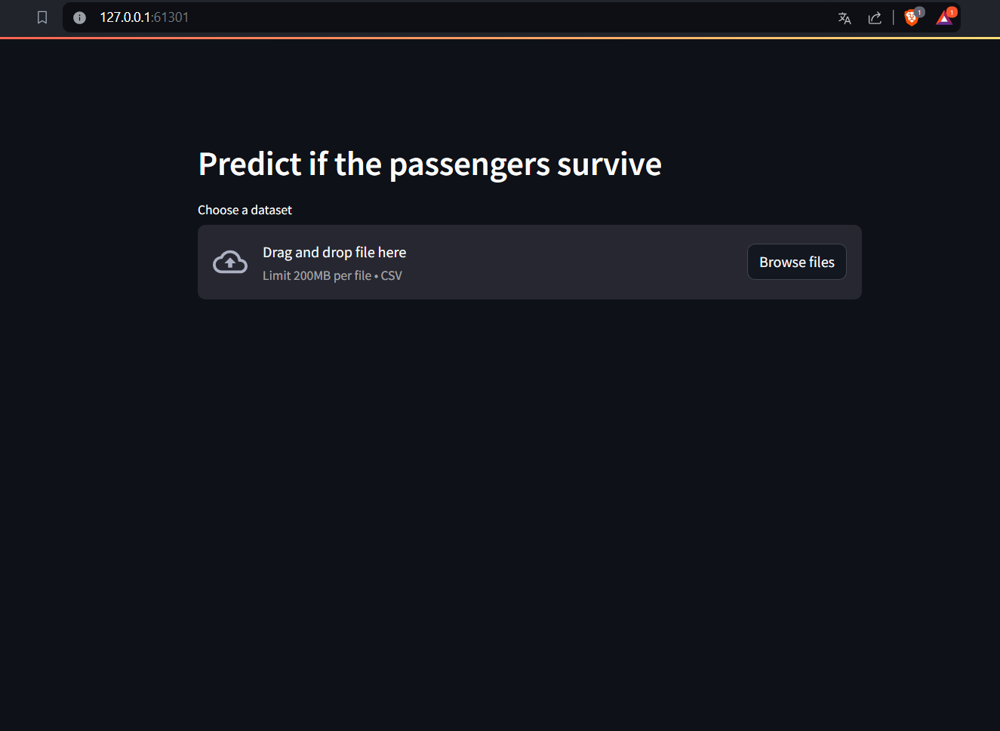

# Projet Big Data
Par : Léonie LE CAM, Quentin DE GIOVANNI, Matteo COUCHOUD


## Cluster Minikube

Ce tutoriel assume que les package `kubernetes` et `minikube` ont été installés sur votre machine.

Dans le terminal de commandes Windows/Linux

- lancer minikube avec une configuration cpu/memory
`minikube start --cpus 2 --memory 2048`

- stopper le cluster minikube :
`minikube stop`

- Supprimer le cluster minikube :
`minikube delete`

## Déploiement du cluster depuis les fichiers .yaml

1. Prérequis : lancer le terminal Windows/Linux dans le dossier `cluster` du repository.

2. Appliquer les fichiers .yaml au cluster :
`kubectl apply -f resources/titanic-d-s.yaml`

Le terminal devrait afficher les lignes suivantes :
```
namespace/titanic unchanged
service/titanic-service unchanged
deployment.apps/titanic-app unchanged
```

3. Visualiser les services dans le namespace `titanic` :
`kubectl get svc -n titanic`

4. Visualiser les pods dans le namespace `titanic` :
`kubectl get pods -n titanic`

5. Récupérer l'url du service :
`minikube service titanic-service --url -n titanic`

Après quelques secondes, le terminal devrait afficher une adresse comme celle-ci :
`http://127.0.0.1:61301`

6. Copier/Coller l'addresse dans la barre d'url du navigateur.
L'application Streamlit Titanic devrait être visible :

