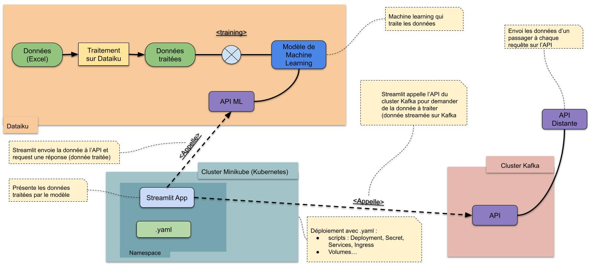
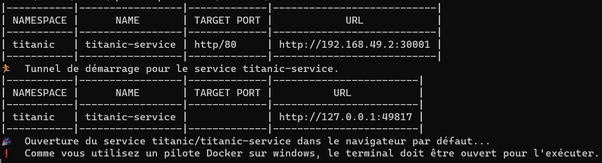
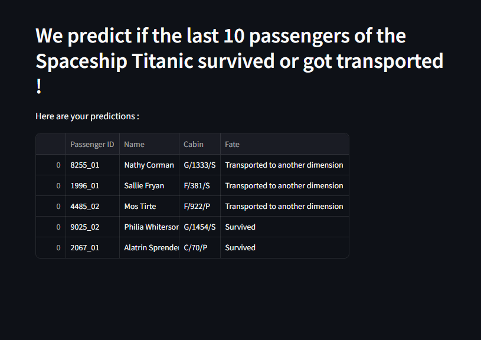

# Projet Big Data
Par : Léonie LE CAM, Quentin DE GIOVANNI, Matteo COUCHOUD\
Ecole/Université : CY-TECH, Cergy\
Année universitaire : 2023-2024\
Module : Big Data

## Contexte
Variante du projet Titanic, Spaceship Titanic demande de prévoir, par des moyens de Machine Learning (ML), si des passagers du vaisseaux arriveront à destination en vie, ou seront "transportés" vers une autre dimension.\
L'intérêt de ce projet est d'ajouter à la prédiction le streaming continu de données (les informations de passagers) sur lesquelles des prédictions seront faites, grâce à la mise à disposition du modèle de ML par une API en ligne.

## Architecture du projet



## Mise en place du cluster Minikube

Ce tutoriel assume que les package `kubernetes` et `minikube` ont été installés sur votre machine.

Dans le terminal de commandes Windows/Linux

- lancer minikube avec une configuration cpu/memory
`minikube start --cpus 2 --memory 2048`

- stopper le cluster minikube :
`minikube stop`

- Supprimer le cluster minikube :
`minikube delete`

## Déploiement du cluster depuis les fichiers .yaml

1. Prérequis : lancer le terminal Windows/Linux dans le dossier `cluster` du repository.

2. Appliquer le manifeste de namespace et secret sur le cluster :
`kubectl apply -f resources/titanic-secrets.yaml`

Le terminal devrait afficher les lignes suivantes :
```
namespace/titanic created
secret/titanic-api-creds created
```

3. Appliquer le manifeste de déploiement sur le cluster :
`kubectl apply -f resources/titanic-deploy.yaml`

Le terminal devrait afficher les lignes suivantes :
```
deployment.apps/titanic-app created
```

4. Avant de passer à l'étape suivante (déploiement du service) :
Vérifier avec `kubectl get pods -n titanic` que le pod `titanic-app-<id>` est à **1/1** dans la colonne **ready**.
Si il est à **0/1** et que **status** est à **ContainerCreating**, patientez quelques temps avant de rééssayer.

5. Une fois le pod lancé, appliquer le manifeste de service au cluster :
`kubectl apply -f resources/titanic-nodeport.yaml`

Le terminal devrait afficher la ligne suivante :
```
service/titanic-service created
```

6. Visualiser les services dans le namespace `titanic` :
`kubectl get svc -n titanic`

7. Récupérer l'url du service :
`minikube service titanic-service --url -n titanic`

Après quelques secondes, le terminal devrait afficher une adresse comme celle-ci :


8. Copier/Coller l'addresse dans la barre d'url du navigateur.
L'application Streamlit Titanic devrait être visible :

